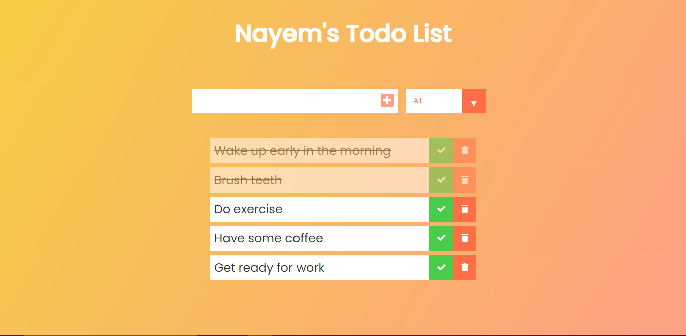

# Simple Todo List App

## Table of contents

- [Overview](#overview)
  - [Screenshot](#screenshot)
  - [Links](#links)
- [My process](#my-process)
  - [Built with](#built-with)
  - [What I learned](#what-i-learned)
  - [Continued development](#continued-development)
- [Author](#author)

## Overview

Users can able to:

- View the optimal layout for the app depending on their device's screen size
- See hover states for all interactive elements on the page
- Add new todos to the list
- Mark todos as complete
- Delete todos from the list
- Filter by all/completed/uncomplete todos

### Screenshot

### Links

- Live Site URL: [Live Preview](https://nayemrabbi.github.io/todo-list/)

## My process

### Built with

- Semantic HTML5 markup
- CSS custom properties
- Flexbox
- JavaScript

### What I learned

This a simple todo list app while working on this project. I have learned DOM operation, how to handle event e.t.c.

## 🚀 About Me

Hi there! 👋 This is Nayem Rabbi. I am a Front End Web Developer. I am currently living in Dhaka, Bangladesh and am working towards gaining global experience. My goal is to help your company grow with my skill set. 💻🚀

## 🔗 Links

## 🛠 Skills

HTML , CSS , JavaScript
